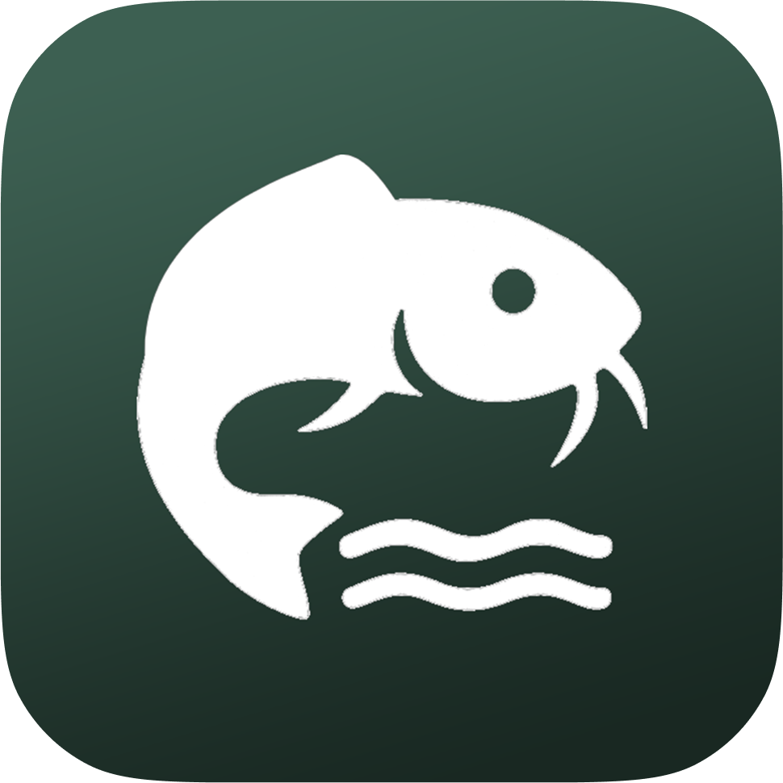

<div align=center>

  

  
  

</div>

Smart Lele is an AIoT project designed to monitor and control catfish pond environments. It leverages sensors and actuators to automate tasks for controlling water quality.

## Features

- Real-time monitoring of temperature, pH, and water level
- AI powered water quality control

## Hardware Requirements

- Microcontroller (ESP32, Arduino)
- Temperature sensor (DS18B20)
- pH sensor
- Water level sensor
- Relays
- LCD display (optional)

## Getting Started

1. **Clone the repository:**
   ```
   git clone https://github.com/yourusername/smart-lele.git
   ```

## Folder Structure

```
smart-lele/
├── cloud/            # Cloud Architecture
├── hardware/         # Schematic
├── microcontrollers/ # Main Microcontrollers code
├── model-dev/        # Model development code
├── web-dev/          # Web development code
└── README.md
```
## Acknowledgement

## License

This project is licensed under the MIT License. See `LICENSE` for details.## Contributing